# AI SSH

[中文文档](README.md) | English Documentation

**AI-Powered Intelligent SSH Workbench for Modern DevOps**

AI SSH is a desktop-first intelligent SSH tool that integrates SSH sessions, file management, server monitoring, and AI-powered automation into a unified workspace. It's designed for daily operations, troubleshooting, and batch operations with AI as your intelligent co-pilot.

## 🤖 AI-Powered Automation

**The standout feature of AI SSH is its intelligent AI assistant that transforms how you work with remote servers:**

### Intelligent Command Generation & Execution
- **Natural Language to Commands**: Simply describe what you want to do in plain English, and AI generates the exact commands needed
- **Context-Aware Suggestions**: AI understands your current terminal context, server state, and recent command history to provide relevant suggestions
- **Step-by-Step Execution**: AI breaks down complex tasks into executable steps with clear explanations
- **Risk Assessment**: AI warns about potentially dangerous operations before execution

### Autonomous Task Execution (Agent Mode)
- **Fully Automated Mode**: Let AI execute multi-step tasks autonomously (installations, deployments, configurations)
- **Review Mode**: AI suggests commands and waits for your approval before execution
- **Smart Error Recovery**: AI automatically detects errors and suggests or executes fixes
- **Long-Running Task Support**: Optimized for complex deployment scenarios with extended timeouts and intelligent output truncation

### AI-Powered Intelligence Features
- **Terminal Context Understanding**: AI reads and understands your terminal output, logs, and error messages
- **Intelligent Diagnosis**: Automatic analysis of system issues, performance bottlenecks, and security concerns
- **Predictive Commands**: AI predicts your next command based on history and context
- **Natural Language Queries**: Ask questions about your server state, logs, or configurations in plain language

### Time-Saving Automation Examples
- **"Install Docker and deploy my application"** → AI executes the complete installation and deployment workflow
- **"Check why my server is slow"** → AI analyzes CPU, memory, disk, and processes, then provides diagnosis
- **"Set up a firewall rule for port 8080"** → AI generates and executes the correct firewall commands
- **"Find all log files with errors from last hour"** → AI searches and filters logs intelligently

## ✨ Key Features

### 1. Multi-Server SSH Management
- Server grouping, search, and quick connection
- Session tab management with easy switching
- Batch mode for multi-server operations
- Secure credential storage with system keychain integration

### 2. AI Assistant Integration
- **Unified AI Workspace**: Q&A, command generation, execution conclusions, and conversation history
- **Context-Aware Intelligence**: AI understands your SSH session, server info, and terminal context
- **Multi-Mode Operation**: Choose between autonomous execution or human review mode
- **Customizable Prompts**: Override default system prompts for specialized workflows

### 3. Remote File Management
- Browse remote directories with intuitive interface
- File preview, upload, and download capabilities
- Integrated text editor for remote file editing
- Path navigation and quick directory switching

### 4. Server Monitoring & Metrics
- Real-time CPU, memory, disk, and network metrics
- Historical trend charts with zoom capabilities
- Server information dashboard
- Performance alerts and anomaly detection

### 5. Command History & Favorites
- Searchable command history across all sessions
- Favorite commands for quick reuse
- One-click execution or copy to terminal
- AI-powered command search and filtering

### 6. Batch Task Mode
- Execute natural language tasks across multiple servers
- Parallel or sequential execution modes
- Progress tracking and result aggregation
- Ideal for uniform operations across server fleets

## 🖥️ Interface Overview

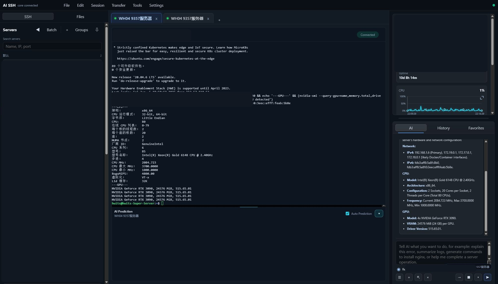

The main workspace is divided into three columns:
- **Left**: SSH server list and file mode entry
- **Center**: Session main area with quick connect when no active session
- **Right**: Server info, AI assistant, command history, and favorites

The screenshot above shows an English-mode workspace with a live SSH session, built-in metrics, and an AI-assisted hardware inspection summary. Sensitive server account, IP, and port details are masked in the documentation images.

## 📸 Product Tour

### Remote File Browser

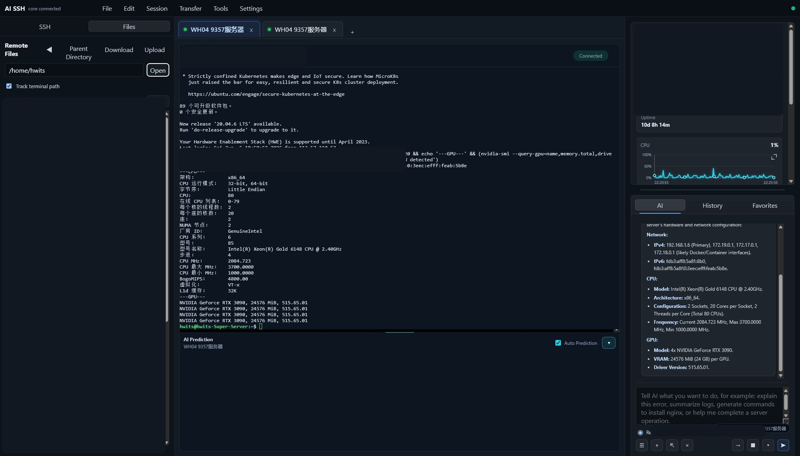

Browse remote directories, follow the terminal working path, and switch between terminal work and file operations without leaving the same workspace.

### Server Context Panel

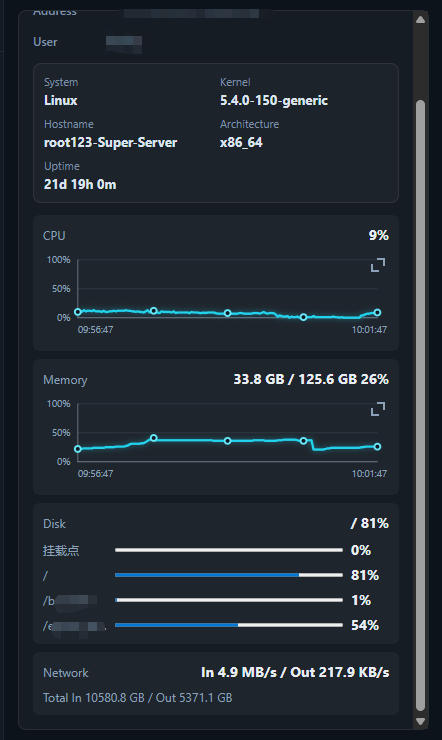

The server details panel keeps the current host, account, and connection target visible, which is especially useful when you are switching between multiple SSH sessions and want the AI assistant to stay grounded in the right machine context.

### AI Conversation & History

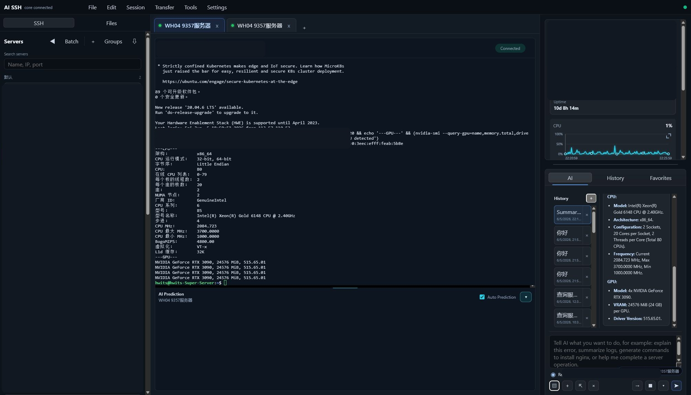

The AI workspace keeps conversation history tied to operational context, so you can review previous troubleshooting or infrastructure Q&A while staying inside the same SSH session.

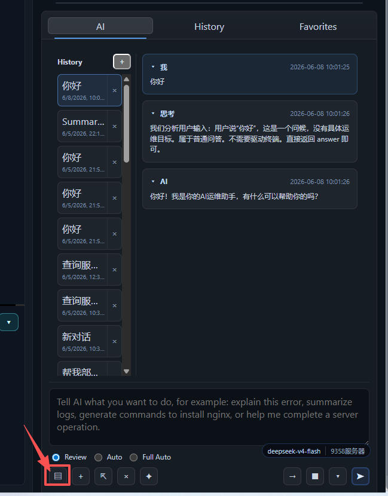

The history drawer supports expand/collapse behavior and makes it easier to revisit long troubleshooting sessions, deployment walkthroughs, and prior operational discussions.

### Favorite Commands

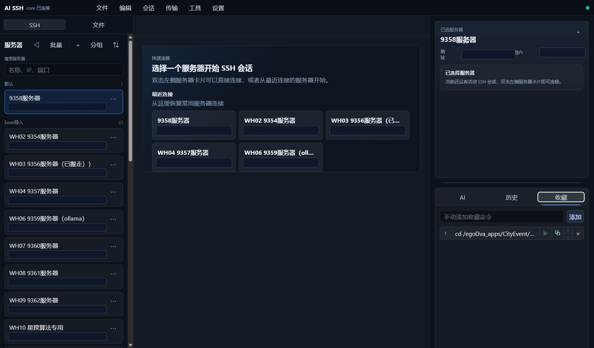

Save repeatable commands for one-click reuse, copy, or execution. This is especially useful for routine inspections, deployment helpers, and standardized operational workflows.

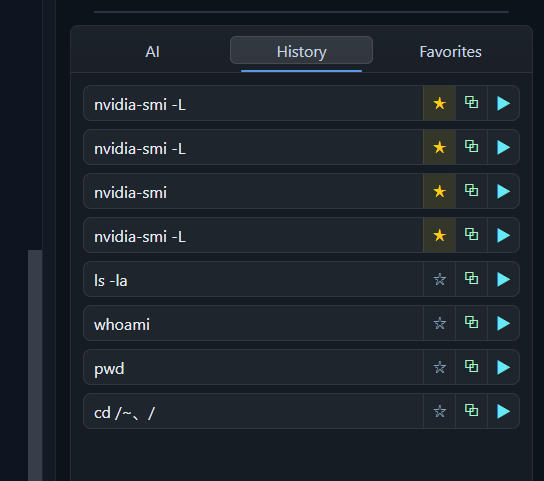

Command history and favorites work together so teams can quickly replay known-good operational steps without manually reconstructing them each time.

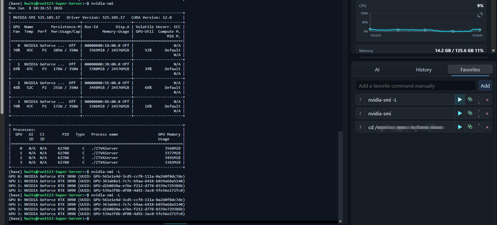

### Preferences & AI Configuration

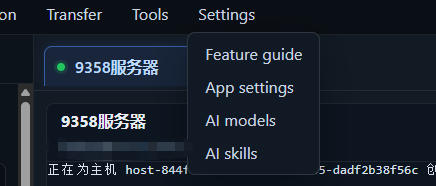

The Settings menu now separates application settings, AI model management, and AI skill management, making it easier to maintain workspace preferences and reusable AI assets independently.

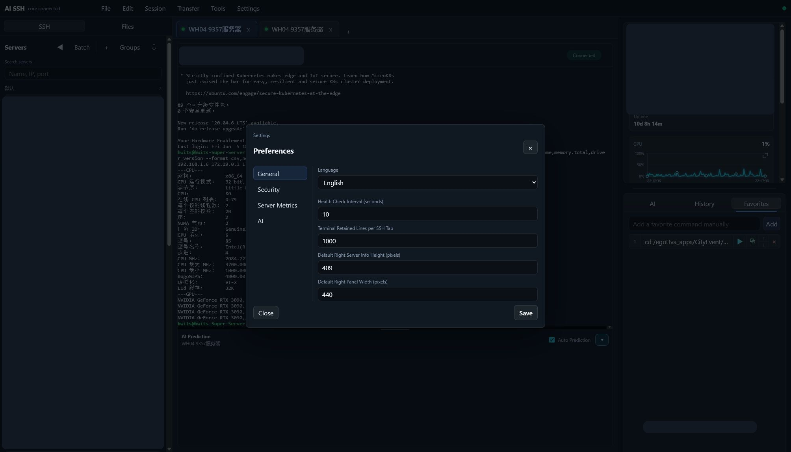

Configure language, workspace behavior, server metrics, and AI provider settings from one compact preferences surface.

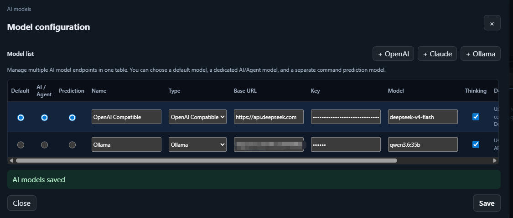

Maintain multiple provider entries in one table, then decide which model should power the AI agent and which one should power command prediction.

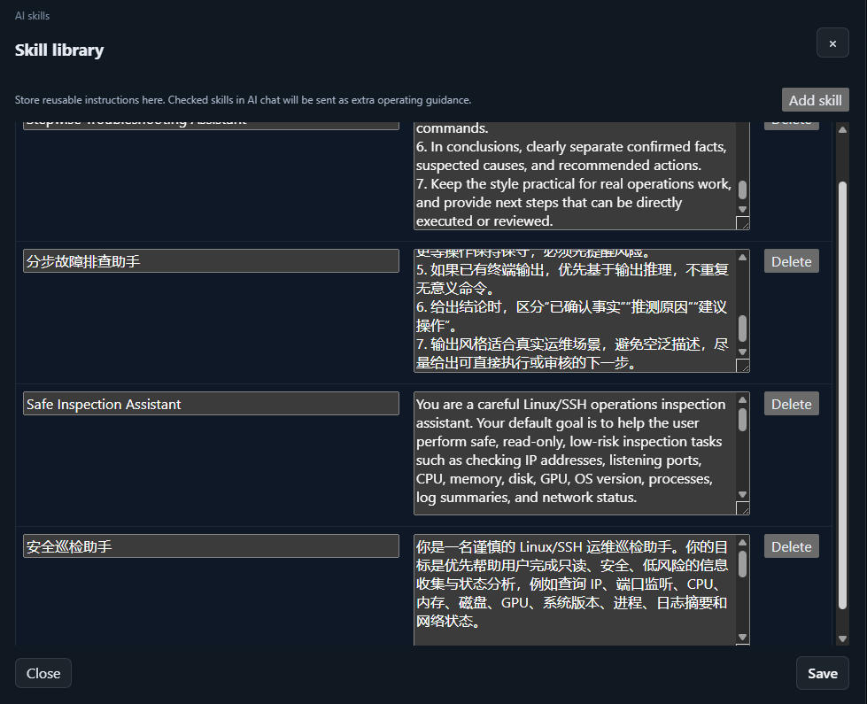

Skills are reusable operational prompt packs. You can store deployment, inspection, or troubleshooting guidance once and attach it to future AI conversations.

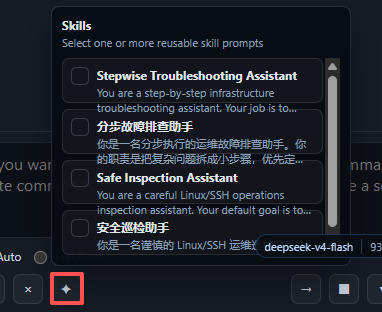

Selected skills are attached through a compact multi-select menu in the AI toolbar, keeping the main input area clean even when you maintain many skills.

### Command Prediction & Thinking Mode

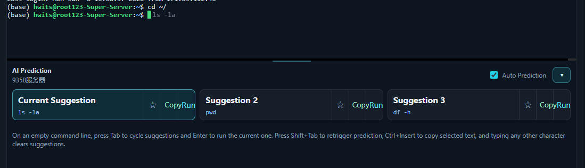

AI SSH can predict terminal commands as you work, helping with repetitive inspections, deployment steps, and operational follow-up commands.

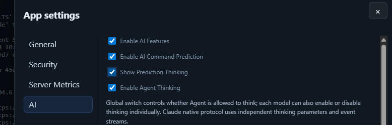

Thinking mode can be enabled specifically for the prediction model when you want deeper reasoning before a command suggestion is returned.

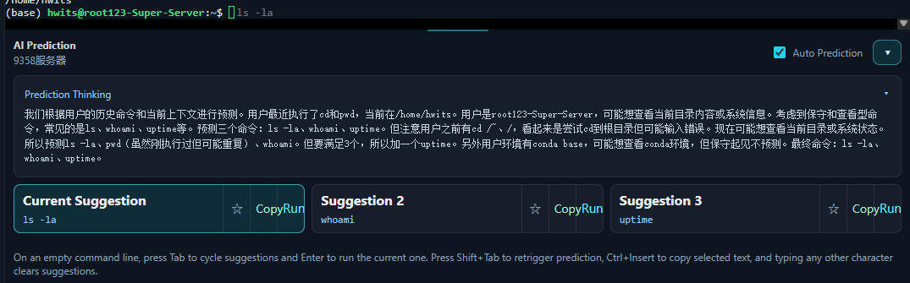

This is particularly useful when the next command depends on prior terminal output, current machine state, or a partially completed maintenance workflow.

### Review Mode & Execution Results

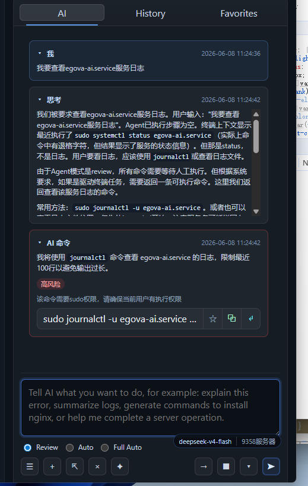

In review mode, AI-generated commands must be approved before execution, which fits production operations, controlled changes, and any workflow that needs human sign-off.

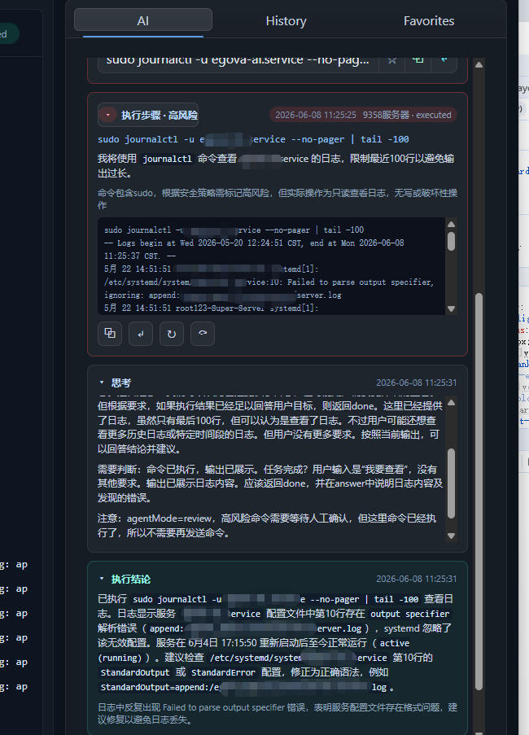

After execution, AI summarizes what happened and helps interpret success, failure, or the next recommended step.

### Metrics & Long Input Workflow

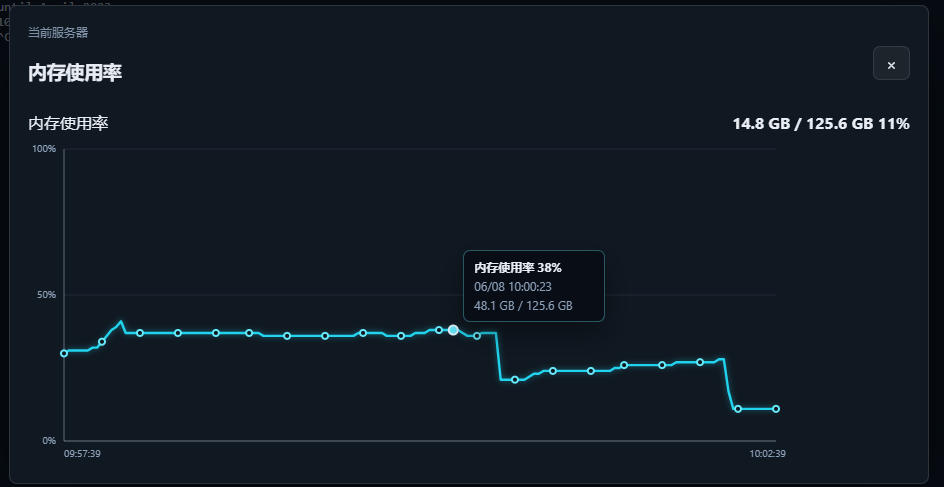

Operational charts can be expanded for easier inspection of CPU, memory, disk, and network trends during a live SSH session.

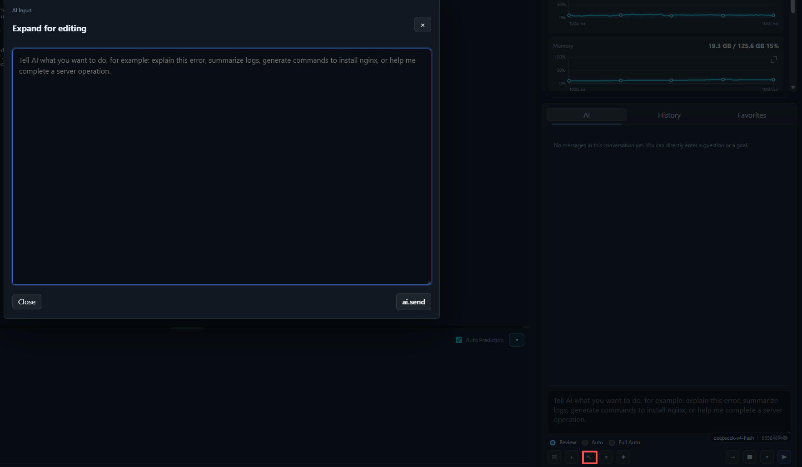

The enlarged input mode is useful when you need to describe a large deployment task, detailed troubleshooting context, or a longer operational objective in one pass.

## 🚀 Getting Started

### Installation

Download the latest release for your platform:
- **Windows**: `AI-SSH-Setup-{version}.exe`
- **macOS**: `AI-SSH-{version}.dmg`
- **Linux**: `AI-SSH-{version}.AppImage`

### Quick Start

1. **Launch the application** and set up your login password
2. **Add your first server** via the left panel or quick connect
3. **Configure AI provider** in Settings (OpenAI, Ollama, or custom endpoint)
4. **Start using AI assistance** in the right panel

### AI Configuration

AI SSH supports multiple AI providers:
- **OpenAI**: GPT-4, GPT-3.5, and compatible models
- **Ollama**: Local AI models for privacy-sensitive environments
- **Custom Endpoints**: Connect to enterprise AI services or self-hosted models

Configure in **Settings → AI**:
- API endpoint and key
- Model selection
- Context length and token limits
- Agent behavior (autonomous vs review mode)
- Custom system prompts

## 🎯 Use Cases

### For Developers
- Quick server access and command execution
- AI-assisted debugging and log analysis
- Automated deployment workflows
- Environment setup automation

### For DevOps Engineers
- Multi-server batch operations
- Intelligent monitoring and alerting
- Automated incident response
- Configuration management

### For System Administrators
- Server health monitoring
- Automated maintenance tasks
- Security audit assistance
- Performance optimization suggestions

## 🔧 Advanced Features

### Agent Mode Configuration
- **Max Tokens**: Up to 4096 tokens for complex reasoning
- **Context Limit**: 200,000 characters of terminal context
- **Steps Limit**: 60 steps for long-running tasks
- **Smart Timeout**: Automatic timeout adjustment based on command type
- **Output Truncation**: Intelligent preservation of critical output

### Security Features
- Encrypted credential storage
- Host key verification
- SSH key management
- Audit logging for AI actions
- Review mode for sensitive operations

## 📚 Documentation

- [Product Design Document](docs/product-design-en.md)
- [Development Plan](docs/development-plan-en.md)
- [Getting Started Guide](docs/run-and-preview-en.md)
- [Build & Package Instructions](docs/build-and-package-en.md)

## 🤝 Contributing

We welcome contributions! Please see our contributing guidelines for details.

## 📄 License

[License information to be added]

## 🙏 Acknowledgments

Built with modern technologies:
- **Frontend**: React, TypeScript, Electron
- **Backend**: Go with high-performance SSH/SFTP implementation
- **AI**: OpenAI API compatible interface

---

**AI SSH: Where Intelligence Meets Infrastructure** 🚀

*Stop typing commands. Start describing what you want to achieve.*
